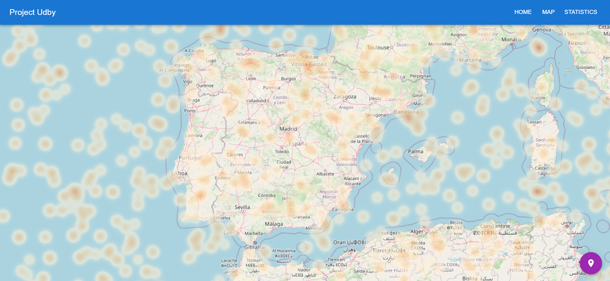

# Project Udby Highway
This project is a response to "Oppdrag - 45784" and is developed in React. User friendliness, simplicity and highlighting  data of valuechas been the main motivations during the development.

When the analyst opens the application he or she is met with a dashboard displaying a table with raw data. It is possible to sort by all columns and filter for a range of criterias like contains, starts with and equals with more. The table is created using DataGrid from Material UI.


The map view is created using deck.gl and OpenStreetMap. There is two different layers that can be toggled between using the button at the bottom right corner. In the default view each datarow is presented using a pointer, while the other layer renders a heatmap with mean age as intensity.




In the third page two different plots are displayed. The barplot on the top shows the age distribution of the entire dataset. By using the bar under the plot it is possible to zoom in on different areas of the plot and move to a range of interest. The bottom plot shows the age distribution of a single state using a bubleplot. One can select a single state, a couple of states or all states. This makes it possible to compare age distributions between different states. All charts are created using recharts.


## Getting Started
1. Clone this project using
```
git clone https://github.com/vebrek/udby-highway.git 
```
2. Cd into directory and install dependencies using `npm i` 
2. Start app in development mode with the command `npm start`

## TODO
* Fetch data from API
* Implement GraphQL to simplify dataflow
* Load data in batches
* Check if a CCNumber is valid
* Track CCNumber on map
* Cluster points on map
* More statistics and plots


## Available Scripts

In the project directory, you can run:

### `npm start`

Runs the app in the development mode.\
Open [http://localhost:3000](http://localhost:3000) to view  it in your browser.

The page will reload when you make changes.\
You may also see any lint errors in the console.

### `npm test`

Launches the test runner in the interactive watch mode.\
See the section about [running tests](https://facebook.github.io/create-react-app/docs/running-tests) for more information.

### `npm run build`

Builds the app for production to the `build` folder.\
It correctly bundles React in production mode and optimizes the build for the best performance.

The build is minified and the filenames include the hashes.\
Your app is ready to be deployed!

See the section about [deployment](https://facebook.github.io/create-react-app/docs/deployment) for more information.

### `npm run eject`

**Note: this is a one-way operation. Once you `eject`, you can't go back!**

If you aren't satisfied with the build tool and configuration choices, you can `eject` at any time. This command will remove the single build dependency from your project.

Instead, it will copy all the configuration files and the transitive dependencies (webpack, Babel, ESLint, etc) right into your project so you have full control over them. All of the commands except `eject` will still work, but they will point to the copied scripts so you can tweak them. At this point you're on your own.

You don't have to ever use `eject`. The curated feature set is suitable for small and middle deployments, and you shouldn't feel obligated to use this feature. However we understand that this tool wouldn't be useful if you couldn't customize it when you are ready for it.
